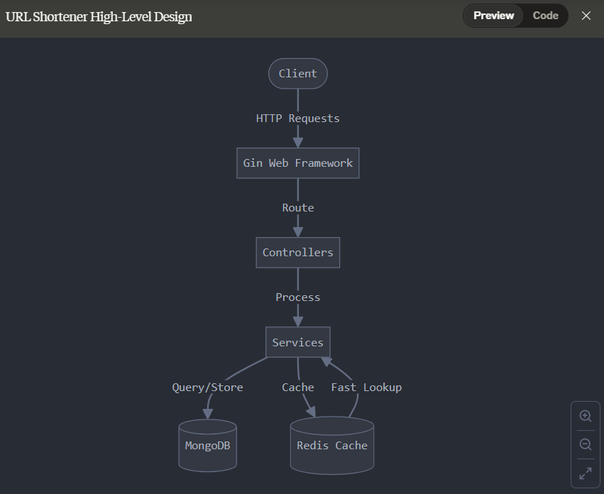
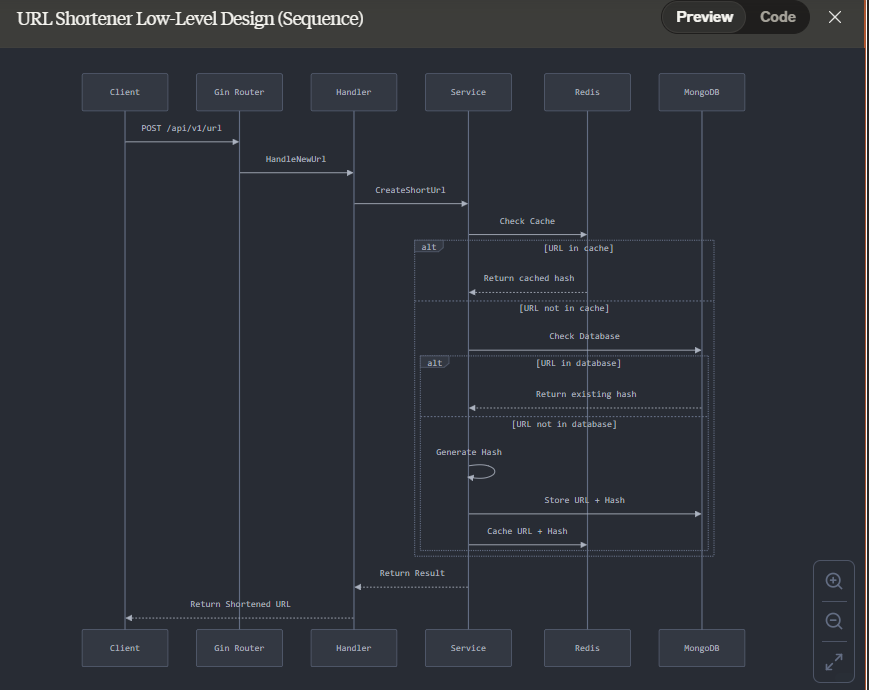

# URL Shortener made with Golang

This project is a URL shortener service built with Golang. It uses the Gin web framework for handling HTTP requests, MongoDB for storing URLs, and Redis for caching.

## Libraries Used

- Gin: A web framework written in Go.
- MongoDB-driver: Official MongoDB driver for Go.
- Redis: A Go client for Redis, used for caching.

## Project Structure

```
.env

.env.sample

.gitignore
.vscode/
CNAME
controllers/
    HandleNewUrl.go
    Home.go
    Redirect.go
database/
    Database.go

go.mod

go.sum

index.html

main.go

middlewares/
    DataBase.go
netlify.toml

README.md

routes/
    Routes.go

services/
    DBServices.go

url-shortner

utils/
    GenerateHash.go
```

## System Design

### High-Level Design (HLD)



### Low-Level Design (LLD)



### URL Shortening Process

1. **Request Handling**: The user sends a POST request to the `/api/v1/url` endpoint with the URL to be shortened.
2. **Hash Generation**: A unique hash is generated for the URL using the `GenerateHash` function in [utils/GenerateHash.go](utils/GenerateHash.go).
3. **Cache Check**: The system checks if the URL already exists in the Redis cache.
4. **Database Check**: If the URL is not found in the cache, the system checks the MongoDB database.
5. **Store URL**: If the URL is not found in the database, it is stored in MongoDB and the hash is cached in Redis.
6. **Response**: The shortened URL is returned to the user.

### URL Redirection Process

1. **Request Handling**: The user sends a GET request to the `/:url` endpoint with the shortened URL.
2. **Cache Check**: The system checks if the hash exists in the Redis cache.
3. **Database Check**: If the hash is not found in the cache, the system checks the MongoDB database.
4. **Cache Update**: If the hash is found in the database, it is cached in Redis.
5. **Redirection**: The user is redirected to the original URL.

## Redis Cache

Redis is used to cache the mappings between original URLs and their shortened hashes. This reduces the load on the MongoDB database and improves the performance of the URL redirection process.

### Why Redis is Fast

Redis is an in-memory data structure store, which means it stores data in RAM rather than on disk. This allows for extremely fast read and write operations. Additionally, Redis supports various data structures like strings, hashes, lists, sets, and more, which makes it versatile for different use cases.

### Redis Configuration

The Redis client is configured in [database/Database.go](database/Database.go):

```go
func Redis() *redis.Client {
    REDIS_ADDRESS := os.Getenv("REDIS_ADDRESS")
    REDIS_USERNAME := os.Getenv("REDIS_USERNAME")
    REDIS_PASSWORD := os.Getenv("REDIS_PASSWORD")

    return redis.NewClient(&redis.Options{
        Addr:     REDIS_ADDRESS,
        Username: REDIS_USERNAME,
        Password: REDIS_PASSWORD,
        DB:       0,
    })
}
```

### Caching Logic

The caching logic is implemented in the `HandleNewUrl.go` and `Redirect.go` files. When a new URL is shortened, it is stored in both MongoDB and Redis. When a shortened URL is accessed, the system first checks Redis before querying MongoDB.

## Running the Project

1. **Install Dependencies**: Run `go mod tidy` to install dependencies.
2. **Set Environment Variables**: Create a 

.env

 file based on the 

.env.sample

 file and set the required environment variables.
3. **Run the Server**: Use `go run main.go` to start the server.

## Endpoints

- **POST /api/v1/url**: Shorten a new URL.
- **GET /:url**: Redirect to the original URL.

## License

This project is licensed under the MIT License.
```

### Explanation of the Architecture Diagrams

#### High-Level Design (HLD)

The High-Level Design diagram provides an overview of the system architecture, showing the main components and their interactions. It includes:

- **Client**: The user interface that sends requests to the server.
- **Gin Web Framework**: Handles HTTP requests and routes them to the appropriate controllers.
- **Controllers**: Process incoming requests, interact with the service layer, and return responses.
- **Services**: Contain business logic and interact with the database.
- **MongoDB**: Stores the original URLs and their corresponding shortened hashes.
- **Redis**: Caches the mappings between original URLs and their shortened hashes for faster access.

#### Low-Level Design (LLD)

The Low-Level Design diagram provides a detailed view of the system's internal workings, including:

- **Request Flow**: Shows the flow of a request from the client to the server, through the controllers, services, and database.
- **Caching Logic**: Illustrates how Redis is used to cache URL mappings and reduce the load on MongoDB.
- **Database Interactions**: Details the interactions between the service layer and MongoDB for storing and retrieving URL mappings.

### Conclusion

This project demonstrates how to build a URL shortener service using Golang, Gin, MongoDB, and Redis. The use of Redis for caching improves the performance of the URL redirection process by reducing the load on MongoDB. The project structure promotes separation of concerns, making the codebase easier to manage and maintain.

Thank you for listening. Do you have any questions?

---

This README provides a comprehensive explanation of the project, including its structure, key components, system design, and how Redis is used for caching. You can revise and practice this script to prepare for your presentation.
### Explanation of the Architecture Diagrams

#### High-Level Design (HLD)

The High-Level Design diagram provides an overview of the system architecture, showing the main components and their interactions. It includes:

- **Client**: The user interface that sends requests to the server.
- **Gin Web Framework**: Handles HTTP requests and routes them to the appropriate controllers.
- **Controllers**: Process incoming requests, interact with the service layer, and return responses.
- **Services**: Contain business logic and interact with the database.
- **MongoDB**: Stores the original URLs and their corresponding shortened hashes.
- **Redis**: Caches the mappings between original URLs and their shortened hashes for faster access.

#### Low-Level Design (LLD)

The Low-Level Design diagram provides a detailed view of the system's internal workings, including:

- **Request Flow**: Shows the flow of a request from the client to the server, through the controllers, services, and database.
- **Caching Logic**: Illustrates how Redis is used to cache URL mappings and reduce the load on MongoDB.
- **Database Interactions**: Details the interactions between the service layer and MongoDB for storing and retrieving URL mappings.

### Conclusion

This project demonstrates how to build a URL shortener service using Golang, Gin, MongoDB, and Redis. The use of Redis for caching improves the performance of the URL redirection process by reducing the load on MongoDB. The project structure promotes separation of concerns, making the codebase easier to manage and maintain.

Thank you for listening. Do you have any questions?

---

This README provides a comprehensive explanation of the project, including its structure, key components, system design, and how Redis is used for caching. You can revise and practice this script to prepare for your presentation.